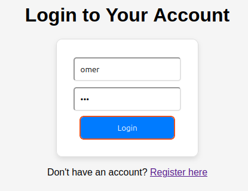
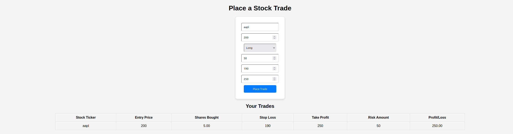

# Stockpnl Microservice App

## Microservice App designed to help traders manage portfolios, track trades, and analyze performance dynamically.

### The project is made up of 3 repositories
🔹 **Microservices** → [StockPNL Microservice](https://github.com/omerrevach/stockpnl_microservice.git)  
🔹 **Infrastructure** → [StockPNL Infrastructure](https://github.com/omerrevach/stockpnl_infrustructure.git)  
🔹 **Manifests & Configs** → [StockPNL Kubernetes Manifests](https://github.com/omerrevach/stockpnl_manifests_test.git)  

## Features
- User management (registration, login)
- Trade management (real-time trade placement, profit/loss calculations)
- Portfolio analytics

## Tech Stack
- Language: Python
- Framework: FastAPI
- Database: MySQL (via Helm chart)
- Deployment: Docker Compose, Kubernetes
- CI: GitHub Actions

## Ci Pipeline:
- Each microservice has a CI pipeline in its own branch dedicated to it
- Each CI pipline runs tests: sherlock-scanner(my own tool to scan for hardcoded secrets/api's) and Bandit(to detect security issues in code)
- Build docker image with current commit as the tag
- Pushes the docker image to dockerhub
- Triggers the CD pipeline in stockpnl_manifests repo to deploy the app

### Each microservice is built and maintained in a different branch in this repo

### Deployment of the app can be found in - https://github.com/omerrevach/stockpnl_manifests.git
